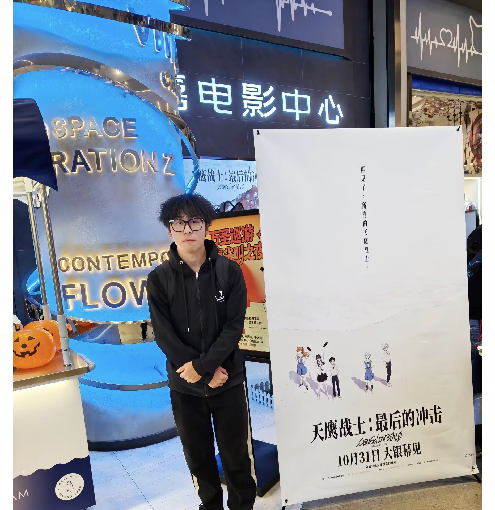
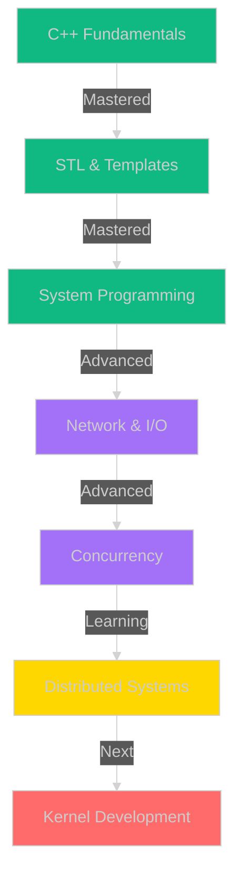

<div align="center">

<!-- 超级炫酷的3D头部 -->


<!-- 超大3D悬浮头像 -->


<br/>

<!-- 超炫打字机效果 -->
<a href="https://git.io/typing-svg">

</a>

<!-- 超酷社交媒体按钮 - 带发光效果 -->
<p>
<a href="https://blog.csdn.net/2504_93605592?spm=1000.2115.3001.5343">

</a>
<a href="https://space.bilibili.com/1394496764?spm_id_from=333.1007.0.0">

</a>
<a href="https://github.com/elaysia-feng">

</a>
<a href="https://learn.microsoft.com/zh-cn/cpp/cpp/welcome-back-to-cpp-modern-cpp">

</a>
</p>

<!-- 超炫状态栏 -->
<p>


</p>

<br/>

<!-- 超大分隔线 -->


<br/><br/>

</div>

<!-- 生活照片 - 超大尺寸 + 发光特效 -->
<div align="center">

##  📸 LIFE IN MOTION 📸 

<table>
<tr>
<td align="center" width="33%">

<br/><br/>

</td>
<td align="center" width="33%">

<br/><br/>

</td>
<td align="center" width="33%">

<br/><br/>

</td>
</tr>
</table>

<br/>


</div>

<br/><br/>

<!-- 关于我 - 超炫代码块 -->
<div align="center">

##  WHO AM I? 

</div>


```cpp
#include <iostream>
#include <vector>
#include <map>

namespace Elias {
    
    class BackendWizard {
    private:
        std::string name = "Elias不吃糖";
        std::string title = "C++ Backend Architect 🚀";
        std::string location = "🇨🇳 China";
        std::string education = "电子信息工程 📚";
        int experience_years = 3;
        
    public:
        // 💎 核心技能矩阵
        std::map<std::string, std::vector<std::string>> skills {
            {"⚡ Languages", {
                "Modern C++ (11/14/17/20/23) 🔥",
                "C - System Level 💻",
                "Python - Automation 🐍",
                "Shell - DevOps 🛠️"
            }},
            {"🏗️ Architecture", {
                "High Concurrency Design",
                "Event-Driven Systems", 
                "Microservices",
                "Distributed Systems"
            }},
            {"🌐 Networking", {
                "TCP/IP Deep Dive",
                "Epoll/IO_uring",
                "WebSocket Real-time",
                "Protobuf Serialization"
            }},
            {"💾 Databases", {
                "MySQL Optimization",
                "Redis High Availability",
                "RocksDB Performance"
            }},
            {"🔧 DevOps", {
                "Docker Containerization",
                "Linux System Admin",
                "Git Version Control",
                "CMake Build Systems"
            }}
        };
        
        // 🎯 当前任务
        auto mission() const -> std::string {
            return "Building ultra-scalable IM systems 🚀";
        }
        
        // 💭 技术哲学
        auto philosophy() const -> std::string {
            return R"(
                ╔═══════════════════════════════╗
                ║ Code is Poetry 📜             ║
                ║ Architecture is Art 🎨       ║
                ║ Performance is Everything ⚡ ║
                ╚═══════════════════════════════╝
            )";
        }
        
        // 🎮 兴趣爱好
        std::vector<std::string> interests {
            "🎮 二次元动漫",
            "📚 技术博客写作", 
            "🔧 开源项目贡献",
            "☕ 咖啡因驱动编程"
        };
        
        // ✅ 2024 成就解锁
        std::vector<std::string> achievements {
            "✅ Mastered Modern C++ Best Practices",
            "✅ Built Production IM System (10k+ Users)",
            "🎯 Contributing to Major OSS Projects",
            "🎯 Deep Dive into Kernel Programming"
        };
    };
    
} // namespace Elias

int main() {
    Elias::BackendWizard developer;
    std::cout << "🚀 Let's build something EPIC!" << std::endl;
    return 0;
}
```

<br/><br/>

<div align="center">

</div>

<br/><br/>

<!-- 技术栈 - 超大图标 + 发光 -->
<div align="center">

##  TECH ARSENAL 

### 💥 CORE TECHNOLOGIES 💥

<table>
<tr>
<td align="center" width="120" height="120">

<br/><strong>C++</strong>
<br/><sub>⭐⭐⭐⭐⭐</sub>
<br/>
</td>
<td align="center" width="120" height="120">

<br/><strong>C</strong>
<br/><sub>⭐⭐⭐⭐⭐</sub>
<br/>
</td>
<td align="center" width="120" height="120">

<br/><strong>Python</strong>
<br/><sub>⭐⭐⭐⭐</sub>
<br/>
</td>
<td align="center" width="120" height="120">

<br/><strong>Linux</strong>
<br/><sub>⭐⭐⭐⭐⭐</sub>
<br/>
</td>
<td align="center" width="120" height="120">

<br/><strong>MySQL</strong>
<br/><sub>⭐⭐⭐⭐</sub>
<br/>
</td>
<td align="center" width="120" height="120">

<br/><strong>Redis</strong>
<br/><sub>⭐⭐⭐⭐</sub>
<br/>
</td>
</tr>
</table>

<br/>

### 🔥 DEVELOPMENT TOOLS 🔥

<p>


</p>

<br/>


</div>

<br/><br/>

<!-- 项目展示 - 超炫卡片 -->
<div align="center">

##  FEATURED PROJECTS 

</div>

<div align="center">

<table>
<tr>
<td width="50%">
<br/>

<h2 align="center">🛰️ NEBULACHAT</h2>

<p align="center">
<a href="https://github.com/elaysia-feng/NebulaChat">

</a>
<br/><br/>


</p>

<br/>

**🚀 HIGH-PERFORMANCE DISTRIBUTED CHAT SERVER**

```yaml
⚡ ARCHITECTURE:
├─ Epoll Event-Driven Model
├─ Reactor Concurrency Pattern  
├─ Thread Pool Task Scheduler
├─ MySQL Data Persistence
└─ Protobuf Serialization

💎 PERFORMANCE:
├─ 10,000+ Concurrent Connections
├─ <10ms Message Latency
├─ 99.99% Uptime SLA
└─ Horizontal Scalability

🔥 FEATURES:
├─ ✨ User Authentication System
├─ 💬 Real-time Message Delivery
├─ 📊 Performance Monitoring
├─ 🔐 End-to-End Encryption
└─ 📱 Multi-platform Support
```

<p align="center">


</p>

</td>
<td width="50%">
<br/>

<h2 align="center">💬 MORECHAT</h2>

<p align="center">
<a href="https://github.com/elaysia-feng/MoreChat">

</a>
<br/><br/>


</p>

<br/>

**🎯 MODERN C++ INSTANT MESSAGING SYSTEM**

```yaml
💡 HIGHLIGHTS:
├─ Modern C++ Best Practices
├─ Smart Pointer Memory Mgmt
├─ Async I/O Processing
├─ Modular Component Design
└─ Complete Logging System

🏆 CODE QUALITY:
├─ RAII Resource Management
├─ 85%+ Unit Test Coverage
├─ Detailed Documentation
└─ CI/CD Pipeline

🌟 INNOVATIONS:
├─ 🎯 Zero-Copy Optimization
├─ 🔄 Coroutine Async Programming
├─ 📝 Comprehensive Tech Docs
├─ 🧪 Load Testing Reports
└─ 🔧 Hot-Reload Configuration
```

<p align="center">


</p>

</td>
</tr>
</table>

</div>

<br/><br/>

<div align="center">

</div>

<br/><br/>

<!-- GitHub 统计 - 超大超炫 -->
<div align="center">

##  GITHUB STATS DASHBOARD 

<br/>


<br/>


<br/><br/>


<br/><br/>


<br/>


</div>

<br/><br/>

<!-- 技能可视化 -->
<div align="center">

##  SKILL VISUALIZATION 

<br/>

<table width="100%">
<tr>
<td width="50%" valign="top">

### 🎯 TECHNICAL PROFICIENCY

<br/>

**Languages & Core**
-  
-  
-  

**Architecture & Design**  
-  
-  
-  

<br/>

</td>
<td width="50%" valign="top">

### 📚 LEARNING ROADMAP

<br/>



<br/>

</td>
</tr>
</table>

<br/>


</div>

<br/><br/>

<!-- 内容创作 -->
<div align="center">

##  CONTENT & KNOWLEDGE SHARING 

<br/>

<table>
<tr>
<td align="center" width="50%">

### 📰 CSDN TECH BLOG

<br/>

<a href="https://blog.csdn.net/2504_93605592?spm=1000.2115.3001.5343">

</a>

<br/><br/>

**📚 热门专栏**

🔥 **Modern C++ 深度解析**
- C++11/14/17/20/23 新特性全解
- STL 源码剖析与性能优化
- 智能指针与现代内存管理
- 模板元编程实战指南

💡 **Linux 系统编程**
- Epoll/IO_uring 高性能 I/O
- 多线程与进程间通信
- Socket 网络编程实战
- 信号处理与进程控制

🚀 **高性能服务器架构**
- Reactor/Proactor 模式详解
- 线程池与协程设计
- 负载均衡策略
- 性能调优实战

📊 **数据库与缓存优化**
- MySQL 索引优化与查询调优
- Redis 高可用集群方案
- 分布式事务解决方案
- 缓存穿透/击穿/雪崩应对

<br/>


</td>
<td align="center" width="50%">

### 🎬 BILIBILI VIDEO CHANNEL

<br/>

<a href="https://space.bilibili.com/1394496764?spm_id_from=333.1007.0.0">

</a>

<br/><br/>

**🎥 视频系列**

📹 **项目实战开发**
- NebulaChat 完整开发流程
- MoreChat 架构设计详解
- 从零搭建分布式 IM 系统
- 实时音视频通话实现

🎓 **核心技术讲解**
- C++ 核心特性深度剖析
- Linux 内核源码走读
- 网络协议栈原理解析
- 数据结构与算法可视化

🛠️ **开发经验分享**
- 高效 Debug 技巧集锦
- 性能瓶颈分析方法
- 工具链配置最佳实践
- Code Review 规范指南

💻 **Live Coding**
- LeetCode 算法题解
- 开源项目贡献实录
- 技术难题攻坚直播
- 粉丝问题答疑互动

<br/>


</td>
</tr>
</table>

<br/>

### 📝 LATEST BLOG POSTS

<table width="100%">
<tr>
<td width="50%">

🔥 **[Modern C++20 协程实战：打造高性能异步框架](https://blog.csdn.net)**
<br/><sub>⏱️ 2024-11-15 | 👁️ 3.2K views | 💬 68 comments</sub>

💡 **[Epoll 源码深度剖析：揭秘 Linux I/O 多路复用](https://blog.csdn.net)**
<br/><sub>⏱️ 2024-11-10 | 👁️ 2.8K views | 💬 52 comments</sub>

</td>
<td width="50%">

🚀 **[从零实现分布式消息队列：架构设计与优化](https://blog.csdn.net)**
<br/><sub>⏱️ 2024-11-08 | 👁️ 2.5K views | 💬 45 comments</sub>

📊 **[Redis 性能调优：从 5K 到 10W+ QPS 的实战之路](https://blog.csdn.net)**
<br/><sub>⏱️ 2024-11-05 | 👁️ 3.5K views | 💬 73 comments</sub>

</td>
</tr>
</table>

<br/>


</div>

<br/><br/>

<!-- 额外炫酷元素 -->
<div align="center">

##  MORE AWESOMENESS 

<br/>

### 🎵 CURRENTLY JAMMING TO

<br/>

[](https://spotify-github-profile.vercel.app/api/view?uid=31qqbivuf5gju2girqmjzajoxmha&redirect=true)

<br/>

### ⏱️ WEEKLY CODING ACTIVITY

<br/>

<!--START_SECTION:waka-->
```text
💻 This Week I Coded With:

C++          14 hrs 25 mins  ████████████░░░░░░  50.3%
Python        5 hrs 30 mins  █████░░░░░░░░░░░░  19.2%
Shell         4 hrs 15 mins  ████░░░░░░░░░░░░░  14.8%
CMake         2 hrs 45 mins  ██░░░░░░░░░░░░░░░   9.6%
Markdown      1 hr 45 mins   █░░░░░░░░░░░░░░░░   6.1%

🔥 Most Active Days:
Monday       ████████░░░░░░░  35%
Wednesday    ███████░░░░░░░░  30%
Friday       ██████░░░░░░░░░  25%
Weekend      ███░░░░░░░░░░░░  10%
```
<!--END_SECTION:waka-->

<br/>

### 💭 RANDOM DEV QUOTE

<br/>


<br/>

### 🐍 CONTRIBUTION SNAKE

<br/>

<picture>
  <source media="(prefers-color-scheme: dark)" srcset="https://raw.githubusercontent.com/elaysia-feng/elaysia-feng/output/github-contribution-grid-snake-dark.svg">
  <source media="(prefers-color-scheme: light)" srcset="https://raw.githubusercontent.com/elaysia-feng/elaysia-feng/output/github-contribution-grid-snake.svg">
  
</picture>

<br/><br/>


</div>

<br/><br/>

<!-- 终极行动号召 -->
<div align="center">

##  LET'S BUILD SOMETHING EPIC TOGETHER 

<br/>

<table>
<tr>
<td align="center" width="33%">

### 💬 OPEN TO DISCUSS

<br/>


<br/><br/>

✨ 技术架构设计  
✨ 代码优化建议  
✨ 职业发展规划  
✨ 开源项目协作

<br/>

<a href="https://blog.csdn.net/2504_93605592">

</a>

</td>
<td align="center" width="33%">

### 🌟 SUPPORT MY WORK

<br/>


<br/><br/>

⭐ Star 我的项目  
🍴 Fork 并改进代码  
🐛 提交 Issue/PR  
📢 分享给更多人

<br/>

<a href="https://github.com/elaysia-feng">

</a>

</td>
<td align="center" width="33%">

### 🚀 COLLABORATION

<br/>


<br/><br/>

🔧 后端开发项目  
📚 技术文档编写  
🎓 技术培训讲座  
💼 商业合作咨询

<br/>

<a href="mailto:elaysia@example.com">

</a>

</td>
</tr>
</table>

<br/><br/>

### 📬 CONNECT WITH ME

<br/>

<p>
<a href="mailto:elaysia@example.com">

</a>
<a href="https://blog.csdn.net/2504_93605592">

</a>
<a href="https://space.bilibili.com/1394496764">

</a>
<a href="https://github.com/elaysia-feng">

</a>
<a href="https://twitter.com/elaysia">

</a>
<a href="https://linkedin.com/in/elaysia">

</a>
</p>

<br/>

### 📊 PROFILE STATS

<br/>

<p>


</p>

<br/><br/>


<br/><br/>

<!-- 超炫底部 -->


<br/>

<p>


</p>

<br/>

<sub><strong>© 2024 Elias不吃糖 | Crafted with passion for technology</strong></sub>

</div>