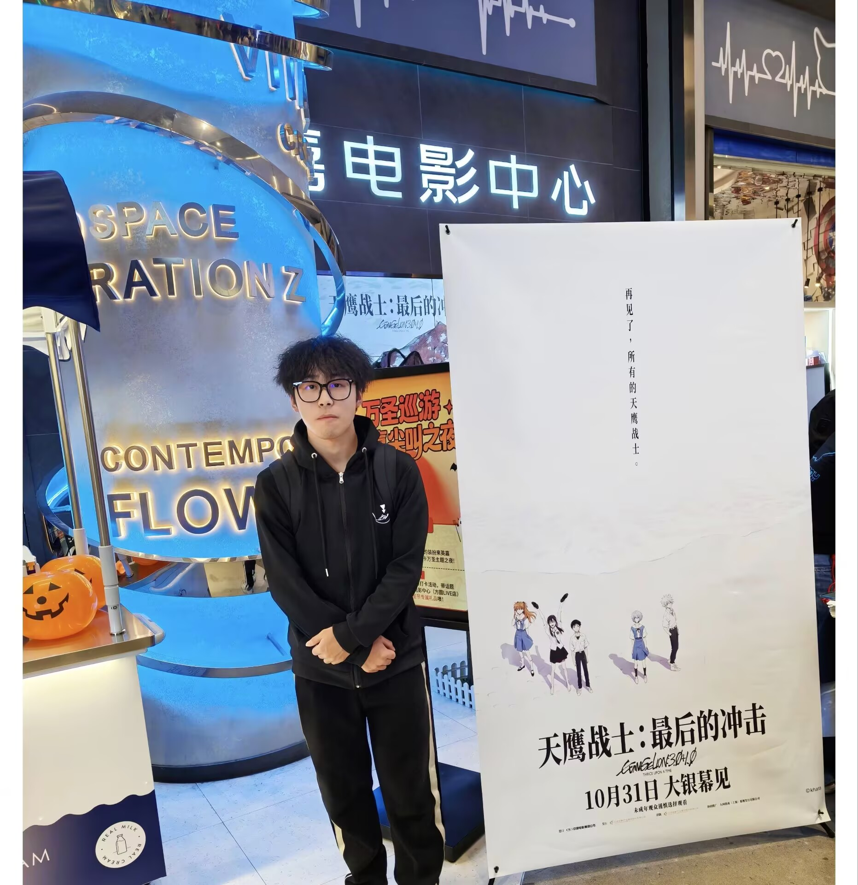

# Eliasis 不吃糖 | Agent + Distributed Systems Developer

<!-- Animated grid background -->
<picture>
  <source media="(prefers-color-scheme: dark)" srcset="data:image/svg+xml,%3Csvg xmlns='http://www.w3.org/2000/svg' width='300' height='300'%3E%3Cdefs%3E%3Cpattern id='g' width='40' height='40' patternUnits='userSpaceOnUse'%3E%3Cpath d='M 40 0 L 0 0 0 40' fill='none' stroke='%23161626' stroke-width='1'/%3E%3C/pattern%3E%3C/defs%3E%3Crect width='100%25' height='100%25' fill='%230d1117'/%3E%3Crect width='100%25' height='100%25' fill='url(%23g)'/%3E%3C/svg%3E">
  
</picture>

<h1 style="margin:16px 0 6px;font-size:2.1rem;font-weight:800;letter-spacing:-0.03em;color:#e6edf3;font-family:system-ui,-apple-system,serif;">
  Elias 不吃糖
</h1>

  Agent&nbsp;开发&nbsp;&middot;&nbsp;Java&nbsp;/&nbsp;Python&nbsp;&middot;&nbsp;LangChain&nbsp;/&nbsp;LangGraph&nbsp;&middot;&nbsp;分布式系统

<!-- Focus badges -->

  LangChain
  LangGraph
  AI Agent
  Distributed IM
  Epoll / IO_uring

<!-- Action links -->

  <a href="https://github.com/elaysia-feng" style="padding:9px 20px;margin:0 5px;background:linear-gradient(135deg,#161b22,#21262d);color:#58a6ff;border:1px solid #30363d;border-radius:10px;text-decoration:none;font-size:0.85rem;font-weight:600;transition:all 0.2s;">GitHub Profile</a>
  <a href="https://blog.csdn.net/2504_93605592?spm=1000.2115.3001.5343" style="padding:9px 20px;margin:0 5px;background:linear-gradient(135deg,#fe2c2c,#ff6b6b);color:#fff;border:1px solid #fe2c2c;border-radius:10px;text-decoration:none;font-size:0.85rem;font-weight:600;transition:all 0.2s;">CSDN Blog</a>
  <a href="https://space.bilibili.com/1394496764" style="padding:9px 20px;margin:0 5px;background:linear-gradient(135deg,#00a1d6,#2cafeb);color:#fff;border:1px solid #00a1d6;border-radius:10px;text-decoration:none;font-size:0.85rem;font-weight:600;transition:all 0.2s;">Bilibili</a>
  <a href="mailto:elaysia@example.com" style="padding:9px 20px;margin:0 5px;background:linear-gradient(135deg,#161b22,#21262d);color:#8b949e;border:1px solid #30363d;border-radius:10px;text-decoration:none;font-size:0.85rem;font-weight:600;transition:all 0.2s;">Email</a>

---

## GitHub Stats

---

## Contribution Graph

<picture>
  <source media="(prefers-color-scheme: dark)" srcset="data:image/svg+xml,%3Csvg xmlns='http://www.w3.org/2000/svg' width='860' height='180'%3E%3Crect width='860' height='180' fill='%230d1117'/%3E%3Ctext x='10' y='160' fill='%236e7681' font-size='11' font-family='monospace' font-weight='600'%3EContribution activity over the last year%3C/text%3E%3C/svg%3E">
  
</picture>

---

## About Me

| Dimension | Focus |
|:---|:---|
| **AI Agent** | LangChain / LangGraph，Multi-Agent 协作与规划，Tool Use / Function Calling |
| **Low-Latency IM** | 10k+ 长连接，端到端延迟 < 10ms，Epoll / IO_uring 深度调优 |
| **Distributed Systems** | 灰度发布、熔断、自愈、可观测性（Logs / Metrics / Trace） |
| **Engineering Culture** | 数据驱动、内核 I/O 剖析、RAII、异常安全、单测优先 |

---

## Tech Stack

**Languages**

**AI & Agent Frameworks**

**Runtimes & Middleware**

### Detailed Skills

  
Languages

  
C++ 11/14/17/20/23 · C · Python 3 · Java 17+

  
AI & Agent

  
LangChain · LangGraph · Tool Use · RAG · Function Calling

  
Systems & Network

  
Linux · Epoll / IO_uring · TCP/UDP · WebSocket · gRPC

  
Architecture

  
Reactor/Proactor · 一致性 vs 可用性 · 微服务治理

  
Data Layer

  
MySQL 读写分离 · Redis Cluster · RocksDB

  
Tooling

  
Docker · CMake · Git · GDB · Valgrind · Shell

---

## Featured Projects

### &nbsp;[NebulaChat](https://github.com/elaysia-feng/NebulaChat) &nbsp;·分布式 IM 平台

  

    基于 Epoll + Reactor 模式的高性能分布式 IM，支撑 <strong style="color:#58a6ff;">10k+</strong> 长连接，端到端延迟 <strong style="color:#3fb950;">< 10ms</strong>。集成 MySQL + Redis + Protobuf，构建完整的监控与压测链路，具备秒级伸缩能力。
  

  

    <strong style="color:#e6edf3;">Stack:</strong> &nbsp;
    C++17
    Epoll
    MySQL
    Redis
    Protobuf
    gRPC
  

  <a href="https://github.com/elaysia-feng/NebulaChat" style="display:inline-flex;align-items:center;gap:6px;padding:7px 16px;background:rgba(88,166,255,0.12);color:#58a6ff;border:1px solid rgba(88,166,255,0.3);border-radius:8px;text-decoration:none;font-size:0.82rem;font-weight:600;">
    <svg width="14" height="14" viewBox="0 0 24 24" fill="currentColor"><path d="M12 0C5.37 0 0 5.37 0 12c0 5.31 3.435 9.795 8.205 11.385.6.105.825-.255.825-.57 0-.285-.015-1.23-.015-2.235-3.015.555-3.795-.735-4.035-1.41-.135-.345-.72-1.41-1.23-1.695-.42-.225-1.02-.78-.015-.795.945-.015 1.62.87 1.845 1.23 1.08 1.815 2.805 1.305 3.495.99.105-.78.42-1.305.765-1.605-2.67-.3-5.46-1.335-5.46-5.925 0-1.305.465-2.385 1.23-3.225-.12-.3-.54-1.53.12-3.18 0 0 1.005-.315 3.3 1.23.96-.27 1.98-.405 3-.405s2.04.135 3 .405c2.295-1.56 3.3-1.23 3.3-1.23.66 1.65.24 2.88.12 3.18.765.84 1.23 1.905 1.23 3.225 0 4.605-2.805 5.625-5.475 5.925.435.375.81 1.095.81 2.22 0 1.605-.015 2.895-.015 3.3 0 .315.225.69.825.57A12.02 12.02 0 0 0 24 12c0-6.63-5.37-12-12-12z"/></svg>
    View Project
  </a>

### &nbsp;[MoreChat](https://github.com/elaysia-feng/MoreChat) &nbsp;·现代 C++ IM

  

    协程 + Async I/O 驱动的现代 IM，集成了日志与配置热更新、单测覆盖 <strong style="color:#a855f7;">85%+</strong>，CI/CD 全链路自动化，性能基准常态化。
  

  

    <strong style="color:#e6edf3;">Stack:</strong> &nbsp;
    C++20
    ASIO
    CMake
    Docker
    GTest
  

  <a href="https://github.com/elaysia-feng/MoreChat" style="display:inline-flex;align-items:center;gap:6px;padding:7px 16px;background:rgba(168,85,247,0.12);color:#a855f7;border:1px solid rgba(168,85,247,0.3);border-radius:8px;text-decoration:none;font-size:0.82rem;font-weight:600;">
    <svg width="14" height="14" viewBox="0 0 24 24" fill="currentColor"><path d="M12 0C5.37 0 0 5.37 0 12c0 5.31 3.435 9.795 8.205 11.385.6.105.825-.255.825-.57 0-.285-.015-1.23-.015-2.235-3.015.555-3.795-.735-4.035-1.41-.135-.345-.72-1.41-1.23-1.695-.42-.225-1.02-.78-.015-.795.945-.015 1.62.87 1.845 1.23 1.08 1.815 2.805 1.305 3.495.99.105-.78.42-1.305.765-1.605-2.67-.3-5.46-1.335-5.46-5.925 0-1.305.465-2.385 1.23-3.225-.12-.3-.54-1.53.12-3.18 0 0 1.005-.315 3.3 1.23.96-.27 1.98-.405 3-.405s2.04.135 3 .405c2.295-1.56 3.3-1.23 3.3-1.23.66 1.65.24 2.88.12 3.18.765.84 1.23 1.905 1.23 3.225 0 4.605-2.805 5.625-5.475 5.925.435.375.81 1.095.81 2.22 0 1.605-.015 2.895-.015 3.3 0 .315.225.69.825.57A12.02 12.02 0 0 0 24 12c0-6.63-5.37-12-12-12z"/></svg>
    View Project
  </a>

---

## Engineering Philosophy

  
Metrics-Driven

  
压测 &rarr; 剖析 &rarr; 调优，先拿数据再定方案

  
Clear Boundaries

  
接口与契约收敛复杂度，无共享可变状态

  
Observability First

  
日志 / 指标 / Trace 起步即埋，可观测性默认开启

  
Code Hygiene

  
RAII · 强类型 · 少裸指针 · 可测试性优先

---

## Recent Interests

  <svg width="13" height="13" viewBox="0 0 24 24" fill="none" stroke="#3fb950" stroke-width="2"><polyline points="22 12 18 12 15 21 9 3 6 12 2 12"/></svg>
  IO_uring + 协程在高并发下的收益与坑点

  <svg width="13" height="13" viewBox="0 0 24 24" fill="none" stroke="#58a6ff" stroke-width="2"><circle cx="12" cy="12" r="10"/><path d="M12 6v6l4 2"/></svg>
  轻量监控 Agent（指标/日志/Trace 一体化）

  <svg width="13" height="13" viewBox="0 0 24 24" fill="none" stroke="#f5a623" stroke-width="2"><path d="M12 2L2 7l10 5 10-5-10-5zM2 17l10 5 10-5M2 12l10 5 10-5"/></svg>
  IM 场景下一致性 vs 可用性的落地取舍

---

## WakaTime

---

## Moments

---

## Contact

  
Let's connect

  

    <strong style="color:#e6edf3;">Email:</strong> <a href="mailto:elaysia@example.com" style="color:#58a6ff;text-decoration:none;">elaysia@example.com</a>
  

  

    <strong style="color:#e6edf3;">CSDN:</strong> <a href="https://blog.csdn.net/2504_93605592" style="color:#58a6ff;text-decoration:none;">blog.csdn.net/2504_93605592</a>
  

  

    <strong style="color:#e6edf3;">Bilibili:</strong> <a href="https://space.bilibili.com/1394496764" style="color:#58a6ff;text-decoration:none;">space.bilibili.com/1394496764</a>
  

  

    Open to: 后端架构 &middot; 性能调优 &middot; 技术写作与分享 &middot; AI Agent 协作
  

---

  Built with precision. Driven by data.

