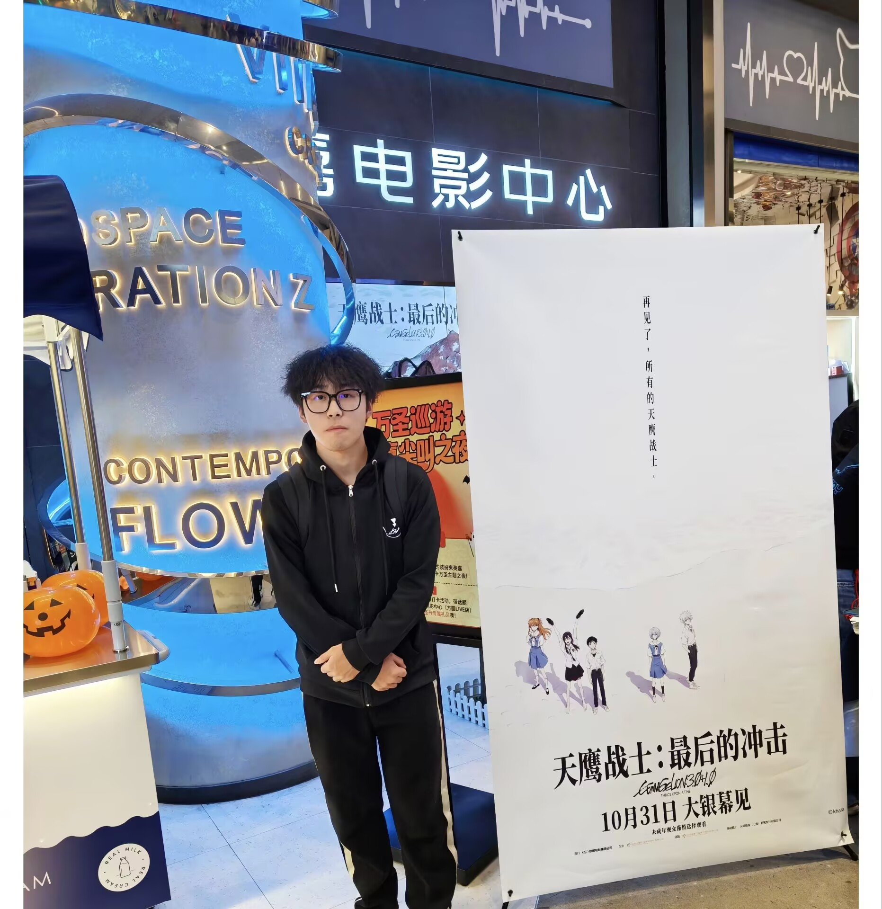

<!--
  Elias 不吃糖 · GitHub Profile README
  Local images only for custom art; shields.io + github-readme-stats for badges/stats
-->

  

 

  

<h1 align="center">Elias 不吃糖</h1>

  <strong>Agent &amp; Distributed Systems Developer</strong> 
  Java / Python / C++ · LangChain / LangGraph · Epoll / IO_uring

  
  
  
  
  

  
  
  
  

---

## GitHub Stats

  
  
   
  

---

## About Me

做 **AI Agent** 与 **低延迟分布式系统**。关心的不是堆框架，而是连接数、端到端延迟，以及系统在故障时是否还能自己站起来。

| Focus | What I care about |
| :--- | :--- |
| **AI Agent** | LangChain / LangGraph, Multi-Agent collaboration &amp; planning, Tool Use / Function Calling |
| **Low-Latency IM** | 10k+ persistent connections, end-to-end latency &lt; 10ms, Epoll / IO_uring deep tuning |
| **Distributed Systems** | Canary release, circuit breaking, self-healing, observability (Logs / Metrics / Trace) |
| **Engineering Culture** | Data-driven, kernel I/O profiling, RAII, exception safety, test-first |

---

## Tech Stack

**Languages**

**AI & Agent**

**Data & Middleware**

<strong>Detailed Skills</strong>

 

| | |
| :--- | :--- |
| **Languages** | C++ 11/14/17/20/23 · C · Python 3 · Java 17+ |
| **AI & Agent** | LangChain · LangGraph · Tool Use · RAG · Function Calling |
| **Systems & Network** | Linux · Epoll / IO_uring · TCP/UDP · WebSocket · gRPC |
| **Architecture** | Reactor/Proactor · Consistency vs Availability · Microservice Governance |
| **Data Layer** | MySQL read/write splitting · Redis Cluster · RocksDB |
| **Tooling** | Docker · CMake · Git · GDB · Valgrind · Shell |

---

## Featured Projects

### [NebulaChat](https://github.com/elaysia-feng/NebulaChat) · Distributed IM Platform

High-performance distributed IM built on Epoll + Reactor pattern, supporting **10k+** persistent connections with end-to-end latency **&lt; 10ms**. Integrated with MySQL + Redis + Protobuf, complete monitoring and stress-testing pipeline with second-level scaling.

`C++17` `Epoll` `MySQL` `Redis` `Protobuf` `gRPC`

[View Project](https://github.com/elaysia-feng/NebulaChat)

### [MoreChat](https://github.com/elaysia-feng/MoreChat) · Modern C++ IM

Coroutine + Async I/O driven modern IM with log and config hot-reload, **85%+** unit test coverage, full CI/CD pipeline automation, and regular performance benchmarking.

`C++20` `ASIO` `CMake` `Docker` `GTest`

[View Project](https://github.com/elaysia-feng/MoreChat)

---

## Engineering Philosophy

| Principle | Meaning |
| :--- | :--- |
| **Metrics-Driven** | Benchmark → Profile → Optimize. Data first, decisions second. |
| **Clear Boundaries** | Interfaces and contracts constrain complexity. No shared mutable state. |
| **Observability First** | Logs / Metrics / Trace instrumented from day one. Default-on observability. |
| **Code Hygiene** | RAII · Strong types · Few raw pointers · Testability first. |

<strong>Recent Interests</strong>

- IO_uring + coroutines in high-concurrency: benefits and pitfalls
- Lightweight monitoring agent (unified metrics / logs / traces)
- Consistency vs availability tradeoffs in IM scenarios

---

## Moments

  
  
  

---

## Contact

| | |
| ---: | :--- |
| **Email** | [elaysia@example.com](mailto:elaysia@example.com) |
| **CSDN** | [blog.csdn.net/2504_93605592](https://blog.csdn.net/2504_93605592) |
| **Bilibili** | [space.bilibili.com/1394496764](https://space.bilibili.com/1394496764) |
| **GitHub** | [github.com/elaysia-feng](https://github.com/elaysia-feng) |

  Open to: Backend Architecture · Performance Tuning · Technical Writing · AI Agent Collaboration
    
  Built with precision. Driven by data.

